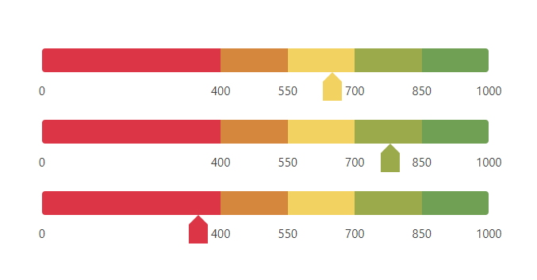

# multi-color-progressbar-with-indicator

> multiple color progressbar with indicator

[](https://www.npmjs.com/package/multi-color-progressbar-with-indicator) [](https://standardjs.com)

## Appearance
  

## Install

```bash
npm install --save multi-color-progressbar-with-indicator
```

## Usage

```jsx
import React, { Component } from 'react'

import MultiColorProgressbar from 'multi-color-progressbar-with-indicator'
import 'multi-color-progressbar-with-indicator/dist/index.css'

class Example extends Component {
  render() {
    var bars = [
      {width: 40, color: '#dc3545'},
      {width: 15, color: '#d5873d'},
      {width: 15, color: '#f2d261'},
      {width: 15, color: '#9baa4b'},
      {width: 15, color: '#6fa053'}
    ]
    let wrapper = {
      padding: '30px'
    }
    return (
      <div style={{width: '50%', margin: '0 auto', paddingTop: '10%'}}>
        <div style={wrapper}>
          <MultiColorProgressbar height={30} bars={bars} minVal={0} maxVal={1000} value={650} />
        </div>
        <div style={wrapper}>
          <MultiColorProgressbar height={30} bars={bars} minVal={0} maxVal={1000} value={780} />
        </div>
        <div style={wrapper}>
          <MultiColorProgressbar height={30} bars={bars} minVal={0} maxVal={1000} value={350} />
        </div>
      </div>
    )
  }
}
```

## Properties

| Prop | DataType | Description | Default |
| ------ | ------ | ------ | ------ |
| height | number | height of progress bar (in pixel) | 10 |
| color | string | default color of progress bar | '#007bff' |
| bars | array of Objects | array of progress objects (width and color) | [{width: 100}] |
| minVal | number | min value of multiple progress bar | 0 |
| maxVal | number | max value of multiple progress bar | 100 |
| value | number | value of multiple progress bar | 0 |
| fontSize | number | font size of step values (in pixel) | 15 |
| indicatorVisible | bool | show/hide indicator | true |
| stepValuesVisible | bool | show/hide step values | true |

## License

MIT © [jsguru-git](https://github.com/jsguru-git)
